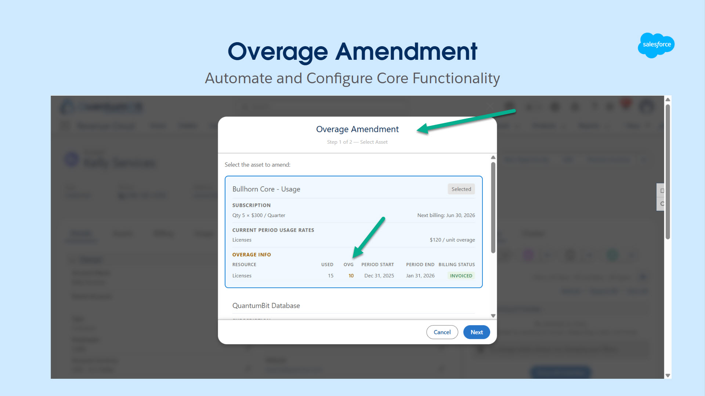
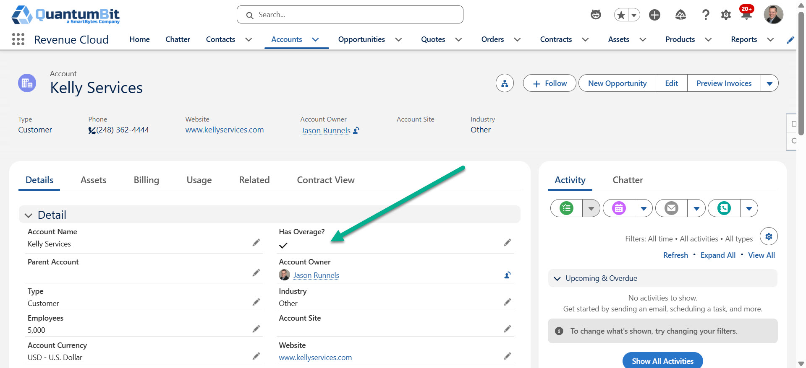
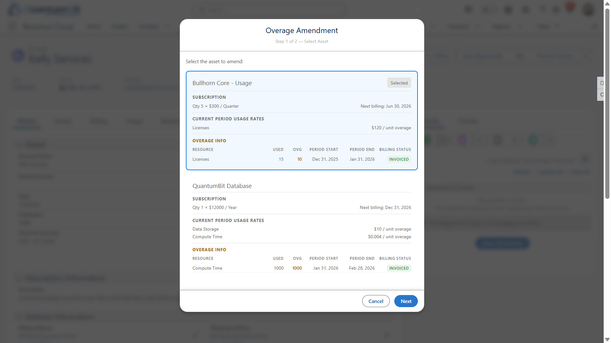
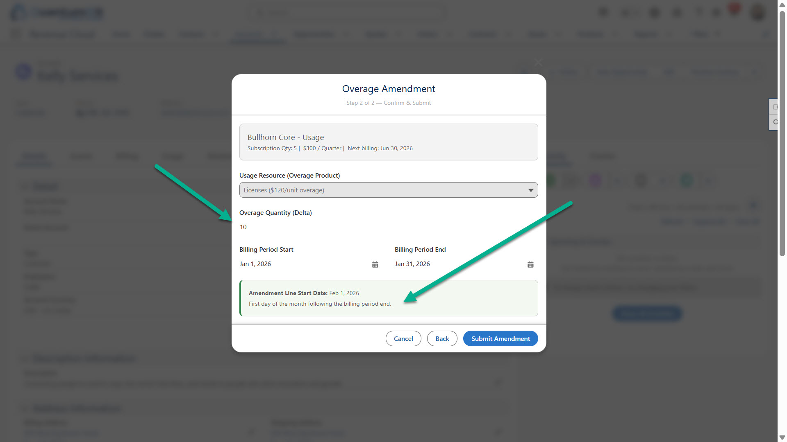
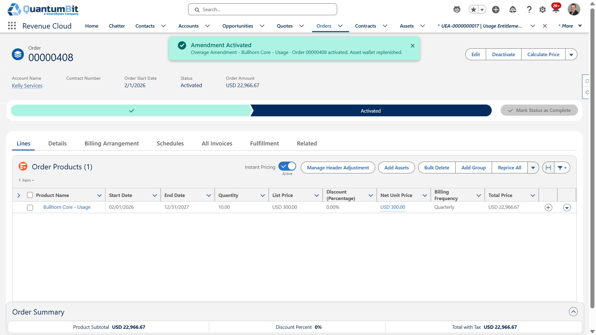
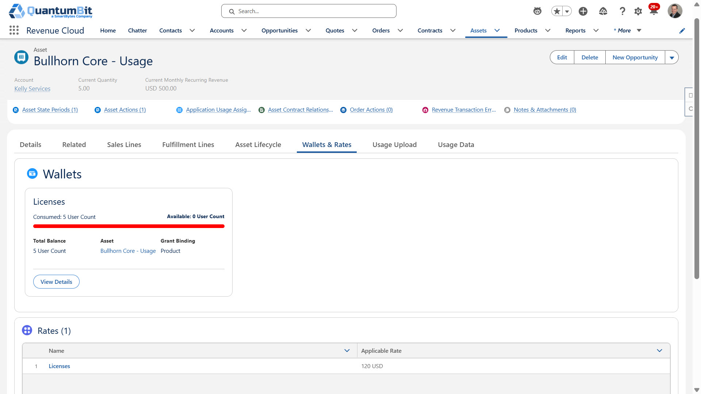
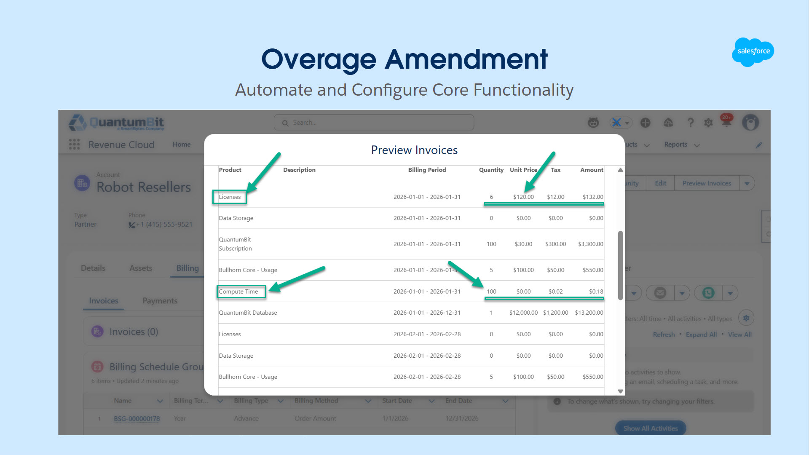

# High Watermark Usage Model with Overage Amendment and Wallet Replenishment

## Overview



A Salesforce Revenue Cloud demo showing a **High Watermark consumption model**: when usage transactions exceed an anchor product's contracted quantity, an overage is detected and an Amendment Quote is automatically created, ordered, and activated - ratcheting the asset quantity to the new high watermark for future billing periods.

**Business story:**
- Anchor product (Bullhorn Core - Usage) starts at qty 5 ($100/mo per seat)
- Usage Transaction Journal records capture actual consumption via a linked Usage Resource ($120/unit overage rate)
- If Feb consumption = 8, overage = 3 - amendment delta = **3** (not cumulative)
- On activation: `Asset.CurrentQuantity` ratchets from 5 to 6, MRR updates, and the next renewal replenishes at the new baseline

> **Note:** This demo illustrates a straightforward High Watermark use case and has two intentional simplifications worth understanding before applying the pattern elsewhere.
>
> **Wallet math:** Revenue Cloud's wallet replenishment formula is `wallet credit = amendment line quantity x usage resource grant quantity`. This works cleanly here because Bullhorn Core - Usage has a grant quantity of 1 - line quantity and wallet credit are 1:1. For products where grant quantity is a multiplier (e.g., 1 license = 60 minutes of compute time), an overage delta of 3 on the amendment line would credit 180 minutes, not 3. Verify the wallet math before applying this pattern to any product with grant quantity > 1.
>
> **No tiered overage:** The amendment sends a flat delta quantity at a single overage rate. There is no support for tiered pricing structures where the per-unit rate changes based on how far usage exceeds the contracted quantity. A full tiered implementation would require rate band detection and separate amendment lines per tier.

---

## Demo Flow

Salesforce platform automation can check the **Has Overage?** field on the Account record - which invokes the demo wizard for High Watermark. (For demo purposes, we'll manually check the box. This might also be a business decision for a customer service persona to invoke the High Watermark overage amendment rather than it being fully automated. Both are possible.)



**Step 1 - Asset Picker:** Card view of all anchor assets showing subscription info, current period usage per resource, and overage warning pills.



**Step 2 - Overage to Next High Watermark Detail Form:** Pre-populated usage resource, overage qty, billing period dates, and auto-calculated amendment line start date (first of next billing period).



Once the Overage Amendment is submitted, the full transaction chain runs automatically:
- `/amend` endpoint creates Amendment Quote + QuoteAction + QLI
- PST Place call patches quote name and QLI start date, triggers async pricing
- Poll `Quote.CalculationStatus` until `Completed` or `CompletedWithPricing`
- `createOrdersFromQuote` invocable action places the order
- Order activated via DML - asset wallet replenishes







---

## Components

### Lightning Web Components

| Component | Purpose |
|-----------|---------|
| `overageAmendmentTrigger` | Account page - wires to `Has_Overage__c`, opens the modal when checked |
| `overageAmendmentModal` | 2-step wizard: asset picker with usage/overage details - overage detail form |

### Apex

| Class | Purpose |
|-------|---------|
| `OverageAmendmentController` | Queries anchor assets, usage period items, and overage rates; orchestrates amendment creation, pricing poll, order creation, and activation |
| `AmendmentQuoteController` | Place Sales Transaction API helper |

### Custom Fields

| Object | Field | Type | Purpose |
|--------|-------|------|---------|
| `Account` | `Has_Overage__c` | Checkbox | Demo trigger - checked by rep to open the overage wizard |
| `Asset` | `CanceledByAsset__c` | Lookup(Asset) | Original asset - successor asset (billing frequency lineage) |
| `Asset` | `ReplacesAsset__c` | Lookup(Asset) | Successor asset - original asset |
| `Contract` | `RenewalOf__c` | Lookup(Contract) | Renewal contract - original contract |

### Supporting Components

| Component | Purpose |
|-----------|---------|
| `BullhornSessionProvider.page` | Visualforce page - provides full session ID via `window.postMessage` for ARM REST API calls |
| `Bullhorn_Org` Remote Site Setting | Authorizes callouts to the org domain |
| `RLM_CreateOrdersFromQuote` Flow | Standard Revenue Cloud flow for order creation from quote |

---

## Key Design Decisions

### Amendment quantity = overage delta only
The `/amend` endpoint receives only the delta (e.g. 3), not the new cumulative total. `StartQuantity` on the QuoteLineItem is calculated by the system from the current asset quantity - do not send it.

### Amendment line start date = first of next billing period
The QuoteLineItem `StartDate` is patched to the first day of the month following the billing period end date, not today. This ensures the ratcheted quantity takes effect at the correct boundary.

### `CompletedWithPricing` is a valid pricing exit state
Polling `Quote.CalculationStatus` must treat both `Completed` and `CompletedWithPricing` as done states. `CompletedWithPricing` is an undocumented variant indicating pricing ran successfully - omitting it causes an infinite poll loop.

### `createOrdersFromQuote` - quoteId must be typed as String
The invocable action binding rejects an Apex `Id` type parameter. Declare `quoteId` as `String` in Apex when calling this action.

> **Note:** During development we encountered API issues generating an amendment order directly in a headless flow. The solution is to invoke the `/amend` endpoint with `outputRecordType = Quote` first, price the quote, then convert to an order via `createOrdersFromQuote`. This should ultimately be supported as a direct order path. Whether the overage amendment surfaces as a Quote (for review and approval before ordering) or goes straight to an Order is a meaningful business decision during implementation - both patterns are architecturally valid and the right choice will depend on the customer's approval workflow.

### Grant replenishment cadence
A new additive `UsageEntitlementBucket` is created on amendment activation (by design - not a bug). Grant replenishment fires on the product's **Usage Grant Refresh Policy** renewal cadence, not on the amendment itself. The renewal uses the updated `CurrentQuantity` as the new baseline.

---

## Prerequisites

### Org Requirements
- Salesforce Revenue Cloud (RLM/RCA) org with ARM and Usage Management enabled
- Anchor product configured with `UsageModelType = Anchor` and an active Product Selling Model
- Usage Resource linked to the anchor product via a Rate Card with `RateCardType = Base`, `Status = Active`
- `BillingPeriodItem` records present for the asset's billing schedule to surface usage data in the modal
- `BullhornSessionProvider` Visualforce page deployed and accessible
- Remote Site Setting updated with **your org's My Domain URL** (see below)

### Remote Site Setting - Update Before Deploying
`remoteSiteSettings/Bullhorn_Org.remoteSite-meta.xml` contains the source org's My Domain URL. Before deploying to any other org, update line 6:

```xml
<url>https://YOUR-ORG-DOMAIN.my.salesforce.com</url>
```

Find your org's URL: **Setup - My Domain - Current My Domain URL**.

### Account Page Layout
The `RLM_Account_Record_Page` flexipage adds the **Has Overage?** trigger and the overage amendment button region to the Account Highlights Panel. Deploy the flexipage and assign it in Lightning App Builder.

### Demo Data (not deployable - load manually)

| Record | Required Fields |
|--------|----------------|
| Product2 (Anchor) | `UsageModelType = Anchor`, active PSM, active PricebookEntry |
| UsageResource | Linked to anchor product; active RateCardEntry with `RateCardType = Base` |
| Account | Any demo account |
| Asset | `Product2Id` - anchor product, `Status = Active`, `Quantity >= 1`, `LifecycleEndDate` in the future |
| BillingScheduleGroup | Linked to the asset via `ReferenceEntityId`; child BillingSchedule with `BillingMethod = OrderAmount` |
| BillingPeriodItem | At least one record with `OverageQuantity > 0` to pre-populate the wizard form |

---

## Deploying

### Deploy via manifest (recommended)
```bash
sf project deploy start --manifest manifest/package.xml --target-org <your-org-alias>
```

### Deploy source format
```bash
sf project deploy start --source-dir force-app --target-org <your-org-alias>
```

### Verify
```bash
sf project deploy report --target-org <your-org-alias>
```

---

## Deploy This Repo with AI

```
Deploy this GitHub repo into my Salesforce org.

Repo:            <PASTE GITHUB URL>
Org:             <alias of my target org>   (this is a <sandbox|dev|dev-edition> org — NOT production)
Expected Org Id: <optional 00D… — if I give it, assert it matches before deploying>
Login type:      <production/dev/trial = login.salesforce.com | sandbox = test.salesforce.com>

Do this:

1. Clone the repo into a subfolder here.

2. Read README.md, sfdx-project.json / cumulusci.yml, and the source tree.
   Tell me what the repo is and which deploy mechanism you'll use.

3. Make sure `sf` (and `cci` if needed) are installed; if not, stop and tell me.

4. Confirm the target org before touching it:
   - Run `sf org display --target-org <alias>` WITHOUT printing the access token
     (prefer `--json` and surface only alias, username, orgId, instanceUrl,
     connectedStatus). If a temp "show secrets" env var is set, don't echo the token.
   - If it errors with NamedOrgNotFoundError / not authorized: do NOT substitute a
     similarly-named org even if the CLI suggests one. Run
     `sf org login web --alias <alias> --instance-url <login url for my Login type>`,
     then PAUSE and tell me to finish the browser login before continuing.
   - Re-run the display, verify Connected, and if I gave an Expected Org Id, assert
     it matches EXACTLY. On any mismatch, stop and ask — never deploy.

5. Run a validate/dry-run deploy and show me the plan.

6. Deploy. (Once the org is confirmed in step 4, you are pre-approved to run the
   metadata deploy; data loads/deletes still require my explicit approval.)

7. Do EVERY post-deploy step the README calls for — permission sets, feature
   toggles, sample data, field/config that isn't on a layout, activation order.
   List anything you cannot automate so I can do it by hand.

8. Verify the deploy succeeded and give me a short summary of what changed and
   what's left for me to do.

Stop and ask me before anything destructive or anything that loads/deletes data.
```
