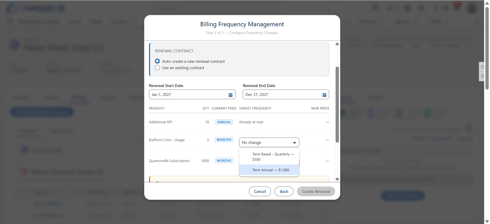

# Manage Billing Frequency Changes for Existing Customers



## Capability Overview Videos

| # | Video | Description |
|---|-------|-------------|
| 1 | *(coming soon)* | End-to-end Manage Billing Frequency Changes walkthrough |
| 2 | [Staging Data for Manage Billing Frequency Changes](https://drive.google.com/file/d/1LHwsiuQeuVNjeM1HZkG-3jHhC6z3BxR_/view?usp=sharing) | Prerequisite demo staging steps required before running the capability |

---

## Overview

ARM Billing cannot change billing frequency of assets with proper Asset Record Succession behavior. The supported workaround is a contract-based "cancel and replace" approach at renewal. This lets the original assets expire naturally and generates a new renewal transaction with a new PSM (higher billing frequency) and activates new assets on the new Renewal Contract.

> **Note:** The "fix" for standalone Billing in release 264 does not support "CPQ" use cases.

This asset offers a Wizard-like experience to Manage Billing Frequency changes for existing customers. The account-level Contract view of assets and obligation management offer additional visuals to help explain the trade-offs and benefits of this product gap.

---

## Asset Record Succession Pattern

When a customer wants to upgrade billing frequency (e.g. Monthly → Quarterly → Annual), the system does not modify the existing asset in-place. Instead it creates a **successor asset** on a new Renewal Contract with the upgraded PSM. The original and successor assets are linked via bi-directional custom lookup fields, providing a clear lineage chain for reporting and analytics.

**Upgrade path:** `Monthly < Quarterly < Semi-Annual < Annual`
**Constraint:** Upgrades must stay within the same SellingModelType (Term → Term, Evergreen → Evergreen).

---

## Components

### Lightning Web Components

| Component | Purpose |
|-----------|---------|
| `billingFrequencyTrigger` | Account page button — launches the billing frequency modal |
| `billingFrequencyModal` | Multi-step wizard: (1) Contract selection, (2) per-line PSM upgrade picker, (3) Confirm |

### Apex

| Class | Purpose |
|-------|---------|
| `BillingFrequencyController` | Orchestrates ARM REST calls: `/amend` endpoint, PSM swap via PricebookEntry, repricing, Renewal Contract + Obligation record creation |

### Custom Fields

| Object | Field | Type | Purpose |
|--------|-------|------|---------|
| `Asset` | `CanceledByAsset__c` | Lookup(Asset) | Original asset → successor asset |
| `Asset` | `ReplacesAsset__c` | Lookup(Asset) | Successor asset → original asset |
| `Contract` | `RenewalOf__c` | Lookup(Contract) | Renewal contract → original contract |

### Supporting Components

| Component | Purpose |
|-----------|---------|
| `BullhornSessionProvider.page` | Visualforce page — provides full session ID via `window.postMessage` for ARM REST API calls |
| `Bullhorn_Org` Remote Site Setting | Authorizes callouts to the org domain |

---

## Key Design Decisions

### `/amend` not `/renew`
The `/renew` endpoint produces quotes with `TransactionType = AdvancedConfigurator`. The PST (Place Sales Transaction) API cannot operate on these quotes. The `/amend` endpoint with `quantityChange=0` and `amendmentStartDate = renewal contract start date` generates a standard Amendment Quote that PST handles correctly.

### No cancel lines on the quote
Original assets expire naturally at `LifecycleEndDate` — no cancel QuoteAction is needed for the renewal use case. Cancel QuoteActions are for mid-term amendments only. Asset succession lineage is tracked via custom fields stamped post-activation.

### Obligation records
One Obligation record is created per frequency-changed product line on the renewal Contract, documenting the billing frequency change for compliance and reporting.

### Session ID
`UserInfo.getSessionId()` returns a restricted Lightning session (401 on REST calls from Apex). Session ID is obtained via the `BullhornSessionProvider` Visualforce page using `window.postMessage`.

---

## Prerequisites

### Org Requirements
- Salesforce Revenue Cloud (RLM/RCA) org with ARM Billing enabled
- Products configured with multiple PSMs (Monthly, Quarterly, Semi-Annual, Annual) sharing the same PricebookEntry structure
- `BullhornSessionProvider` Visualforce page deployed and accessible
- Remote Site Setting authorizing callouts to the org domain

### Asset Renewal Fields
Each active Asset must have `RenewalTermUnit`, `RenewalTerm`, and `PricingSource` populated before the `/renew` endpoint can be called.

**Auto-resolution:** The wizard reads these from the asset's `BillingScheduleGroup` and patches null values automatically at submission time. Most ARM-provisioned assets will have a BSG and will resolve correctly.

**Warning in the modal:** If the wizard displays a yellow "Review Required" warning for an asset, that asset has one or more missing fields and no BSG to resolve from. The warning is informational — unchanged assets are still included in the renewal. To suppress it, set these fields manually on the Asset record:
- `RenewalTermUnit` — match the asset's current billing frequency (`Months`, `Quarterly`, `Semi-Annual`, or `Annual`)
- `RenewalTerm` — typically `1`
- `PricingSource` — typically `ContractedPrice`

### Renewal Contract — AppUsageAssignment Required
Every contract used as a renewal contract must have an `AppUsageAssignment` record with `AppUsageType = RevenueLifecycleManagement`. Without it, `/renew`, order activation, and assetization all fail silently or with cryptic errors.

- Contracts auto-created by this wizard have it inserted automatically.
- **Cloned contracts do not carry related records** — cloning a contract from the Salesforce UI copies the parent record only. If you stage a renewal contract by cloning, open a Developer Console anonymous Apex window and run:
  ```apex
  insert new AppUsageAssignment(
      AppUsageType = 'RevenueLifecycleManagement',
      RecordId = '<your_contract_id>'
  );
  ```
- The wizard also inserts it automatically when you select an existing contract via "Use an existing contract" — so re-running the wizard on a cloned contract will self-heal this.

### Billing Treatment Configuration
The `/renew` API path requires that your Billing Treatment have **Change Billing Frequency** enabled. This is a data configuration step — not deployable as metadata.

**Setup path:** Revenue Cloud App → Billing Policies → select your Billing Policy → Billing Treatments → open the relevant treatment → check **Change Billing Frequency = true**

If this flag is not set, the `/renew` endpoint will generate assets on the renewal contract but billing schedule continuity will not be maintained correctly across the frequency change.

### Account Page Layout
The `RLM_Account_Record_Page` flexipage is included in this repo and adds:
- **Contracts tab** — lists active contracts with start/end dates directly on the Account record
- **Billing Frequency Management button** — launches the wizard from the Account Highlights Panel
- **Billing Schedule Groups tab** — shows BSG records for billing frequency diagnostics

Deploy the flexipage and assign it to the Account object in Lightning App Builder to activate.
